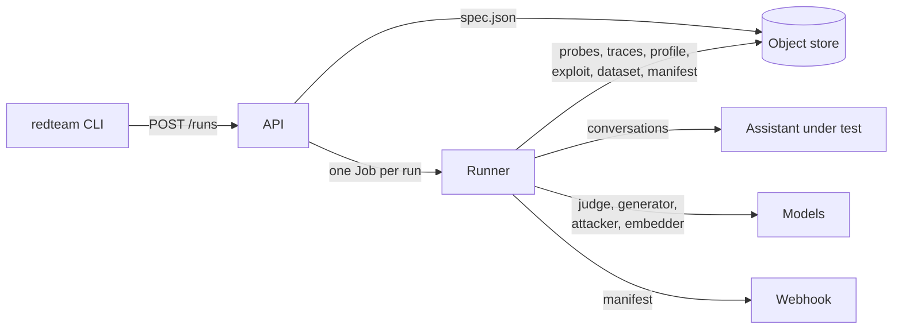

# red-teaming

Red teaming for Alquimia assistants.

Generate adversarial probes anchored in a knowledge base, conduct governed multi-turn
conversations against a live assistant, keep every conversation as immutable evidence, and
deliver the attack dataset, the weakness profile, the exploitation report and a manifest with
honest coverage: what was planned, what closed, what failed.

## How it works



The API validates a request, freezes it, launches one runner and answers state from the store.
The runner pulls the knowledge base, generates a content-addressed probe set, attacks through one
governed door -- budget, pacing, retry policy, safe mode -- and records each conversation the
instant it closes. Nothing in the store is ever rewritten; a relaunched runner resumes from the
difference between the plan and the keys, and never asks the assistant a question it already
answered. The models a run uses -- a control judge, a generator, attackers, an embedder -- are
configuration, declared per run by role, served by vLLM on the appliance or by a hosted provider.

## Try it

```bash
uv sync --all-packages
uv run redteam init                                  # .redteam/ here
uv run redteam local up --build                      # minio, api, seed, receiver, mock assistant
uv run redteam run start spec.json --follow          # against the mock; see docs/deploy/local.md
uv run redteam run result <run_id>
```

## Repository

```
apps/            api · runner · cli
packages/        redteam_<name> libraries with a guarded import graph
deploy/          compose · charts · catalog · appliance · cloud · seed
docs/            adr (why) · architecture (what) · components (how) · deploy (where)
tests/           guards · e2e · live
```

| Read | For |
|---|---|
| [`docs/architecture/`](docs/architecture/) | what a run is, the store, the catalogue bundle, the packages |
| [`docs/components/`](docs/components/) | the API's routes, the runner's pipeline, the command line |
| [`docs/deploy/`](docs/deploy/) | the local stack, a cluster, the appliance, a cloud, the models |
| [`docs/release.md`](docs/release.md) | images on `develop`, releases on `main` |
| [`docs/adr/`](docs/adr/) | the decisions, immutable once accepted |
| [`CLAUDE.md`](CLAUDE.md) | the invariants, the vocabulary, the guards |
| [`CONTRIBUTING.md`](CONTRIBUTING.md) | branches, commit scopes, releases |

## Develop

```bash
uv run pytest -q -m "not live and not docker and not k8s"   # the default tier, guards included
uv run ruff check . && uv run ruff format --check . && uv run mypy apps packages tests scripts
uv run pytest -m docker tests/e2e/test_compose.py            # the stack in containers, via the cli
uv run pytest -m live tests/live                             # a real assistant, a real judge
```

Images are published as packages of this repository (`ghcr.io/alquimia-ai/red-teaming-{api,runner}`);
the command line ships as a single file per platform on every release.
