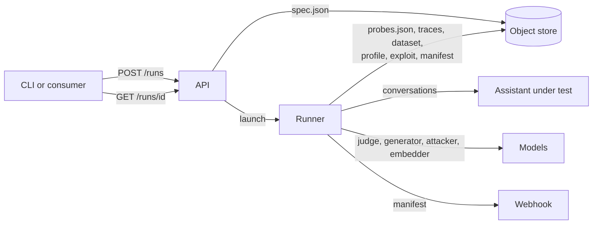

# Architecture

What the system looks like today. Decisions and their reasons live in [`../adr/`](../adr/).

## Components

| Component | Ships as | Responsibility |
|---|---|---|
| **API** (`apps/api`) | container image | Accepts a run, validates it against the published assets and the target's declared capabilities, freezes the request in the store, launches a runner and answers `202`. Publishes and lists catalogue bundles and realism priors. Derives run status from the store and the dispatcher. Holds no state. |
| **Runner** (`apps/runner`) | container image, one process per run | Generates or reuses the probe set, conducts the plan against the assistant through a governed door, records every conversation as an immutable trace, assembles the attack dataset, the weakness profile, the exploitation report and the manifest, and notifies a webhook. |
| **CLI** (`apps/cli`) | zipapp `redteam` | Operator surface: local workspace, catalogue publishing, run governance, local stack. |
| **Object store** | S3-compatible (MinIO on the appliance, managed in the cloud) | The only stateful component. Append-only: nothing under a run's prefix is ever rewritten. |
| **Models** | vLLM on the appliance, hosted providers in the cloud | Control judge, generator, attackers and embedder, bound per run by role. |

The packages under `packages/` are the building blocks; their allowed import graph is enforced by
a guard and documented in `CLAUDE.md`.

## A run, end to end

Detailed documents for the API, the runner, the store layout, the knowledge base and the
catalogue are written as each component lands.
