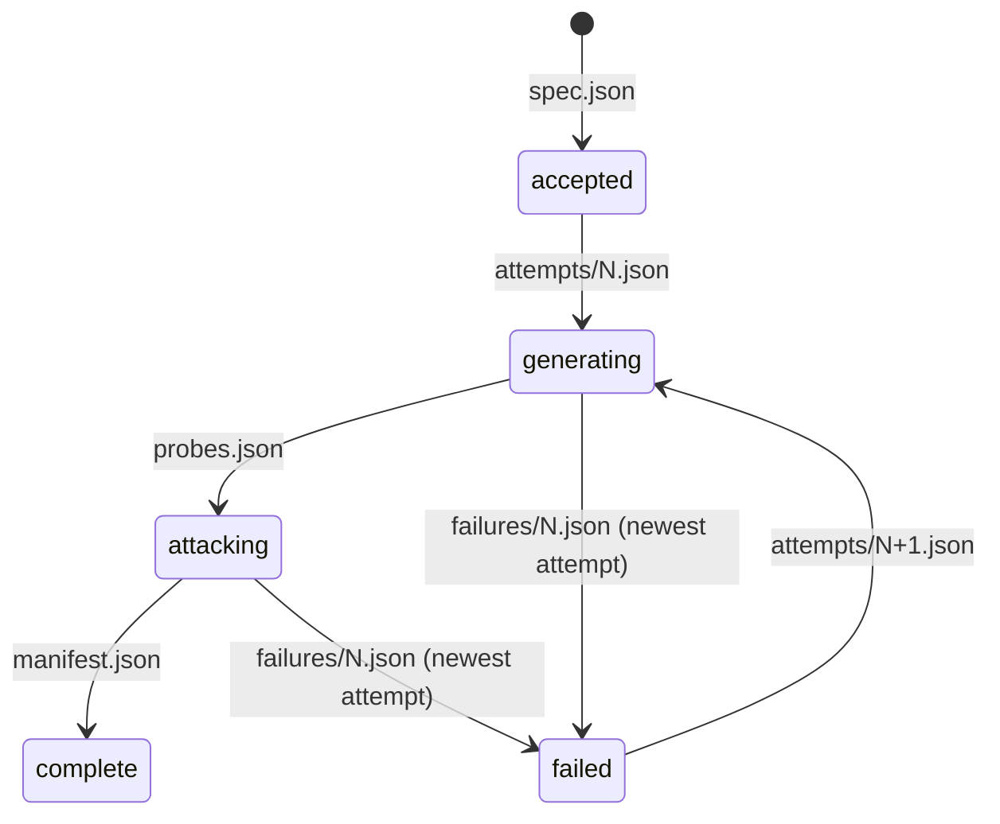

# A run

One accepted request, frozen as `spec.json`, executed by exactly one runner process at a time,
answered from the store. This page follows it end to end.

## 1. The gate

`POST /runs` takes a `RunSpec` and refuses -- with nothing written and nothing launched --
everything that would be expensive to be wrong about later: a run id outside the one rule (a
DNS-1123 label of at most 50 characters, because it is a store prefix and a Job name), a knowledge
base not pinned by digest, a catalogue nobody published or a version nobody published, catalogues
that disagree on the contract, a selection that generates nothing, an attacker a conducted strategy
names and the spec does not bind, a model-driven construction with no generator or context, a
connector kind the platform does not ship, a target that can act with safe mode off, a ceiling
nothing enforces, a hosted model with no credential reference, a reference in the platform's own
`REDTEAM_` namespace, and -- where the platform hands values -- a reference nothing resolves.

What passes is frozen with `catalogue_versions` pinned to the versions the gate read, so a
catalogue published later cannot change what this run generates. The same request again is a 202
and a relaunch; a different request under a frozen id is a 409; `POST /runs:validate` is the gate
alone.

## 2. Launch

The API asks the platform for one runner: a docker container, a Kubernetes Job or a subprocess,
named `redteam-run-<id>` so a second launch collides rather than attacking twice. The runner gets
the store's wiring and exactly the spec's secret references -- resolved into its environment on
docker and the subprocess, as `secretKeyRef`s into the platform's Secret on a cluster. The
platform's answer to "is it alive" is what `status()` reads back later.

## 3. Generation

The runner reads `probes.json` first. If it exists, the set is pinned and nothing is generated. If
not: the brain is pulled by digest into a temporary directory, every selected catalogue's half that
matches the run's shape -- grounded or brainless -- is generated against it, each probe gets a
content-derived id (`engine`, strategy, references, how) and the block it cites, the set is written
once as `blobs/<digest>` and `probes.json` points at it with the generation report. The brain is
gone when generation returns.

## 4. The plan and the difference

`expand(spec, probes)` turns the set into work units -- one per probe per replica, each with a
plugin, a strategy and an `attack_id` derived from the probe and the attack parameters, sorted by
key. `difference(store, plan)` lists the trace prefix once and says which units are closed (a
trace exists), failed (a `.failed` marker exists) and pending. That difference is progress,
resumption and coverage at once.

## 5. The attack

Every unit of the plan is handed to gaussia's Profiler in order, through two doors. `ResumingTarget`
answers closed units from their traces -- the last agent turn, the one that was graded -- and
sends the rest live. `GovernedTarget` is the live door: the capability gate before the first turn,
every call charged to the budget and paced, transport failures acted on by kind (retry as the
target asked, back off, give up, abort), and each exchange recorded as one trace the instant it
closes. A strategy the catalogue delivers as `many` turns is conducted **inside one exchange**: the
attacker writes the next user turn from the transcript and the plugin's objective, every turn goes
through the same gates, gaussia grades the final answer, and the trace carries every turn with why
the conversation ended.

The profile is written the moment it passes the thin-profile check, before the search; the search
runs only with a generator, an embedder, a prior and thresholds all declared, and its report is
written the moment it returns; a marker says the search was attempted so a relaunch never searches
twice. The dataset -- one session per replica, gaussia's roast turns -- and what conduction said
about itself close the attack.

## 6. The manifest and the webhook

`manifest.json` is written once, with the spec and probe digests, the keys of the dataset and the
two control artifacts, the trace count, and coverage read off the store: planned, closed, failed,
in total and per plugin and strategy. Its existence means COMPLETE to every reader. The webhook
carries the keys and never the content, five attempts with backoff and an idempotency key derived
from the run and the phase; a consumer that misses it polls the status and reads the same thing.

An attempt that dies writes a failure record under its own key -- typed by the kind of transport
failure when the channel is what died -- exits non-zero so the platform relaunches, and the
relaunch resumes from the difference.

## The phase, derived

`GET /runs/{id}` reads which keys exist and, beside the phase, what the platform says about the
runner. A run whose store says `generating` or `attacking` and whose platform says the runner is
`unknown` or `failed` is **stalled**; `POST /runs/{id}:resume` creates a new runner, and it
resumes.

## The control artifacts

The profile and the exploitation report are how the run steered itself: which principles the
control judge saw broken most, which categories of interaction the search found to break the
assistant reproducibly. They are delivered because an operator wants to read them, named as
control in the manifest, and never part of the coverage -- no grade can move a count that is read
off keys.

## Frozen realism input

A declared `realism_prior` is resolved at acceptance together with `realism_prior_version` and
`realism_prior_digest`. The request may provide either pin; validation and acceptance return the
resolved identity. Execution verifies the stored bytes and reads only that version. A prior missing
from the store or with a conflicting digest is rejected rather than silently skipped. A legacy run
that needs an unpinned prior must use a new run id. Completed runs remain readable.

## Existing request retries

`POST /runs` first reads an existing frozen specification. Equivalent requests keep its catalogue
and prior pins, even if current publications no longer accept that selection. Explicitly conflicting
pins and other material changes return 409. New runs still pass the full gate; concurrent creation
compares against whichever specification wins the conditional write. Repeating a completed run's
request does not launch another runner; the explicit resume route keeps its existing 409 response.
