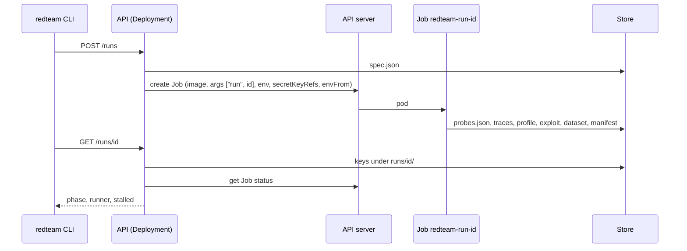

# Kubernetes

`deploy/charts/red-teaming-stack` installs the platform in one namespace. The topology is the one
the local stack runs, with the platform's own primitives in place of docker's: the API is a
Deployment, the store is MinIO or the provider's, and **every run is a `batch/v1` Job** the API
creates through the cluster's own API server.

## What the chart installs

| Object | Name | Why |
|---|---|---|
| Deployment, Service | `red-teaming-api` | the gate; NodePort on the appliance, ClusterIP + Ingress in the cloud |
| ServiceAccount, Role, RoleBinding | `red-teaming-api` | exactly what the dispatcher does: create Jobs, read their status, read pods and their logs; namespaced |
| ServiceAccount | `red-teaming-runner` | a run's identity: nothing in the cluster, the store and the models outside it; carries the pull secret |
| ConfigMap | `red-teaming-api-config` | the API's `REDTEAM_*` wiring, including the names below, which the API stamps on every Job |
| ConfigMap | `red-teaming-runner-config` | the runner's `REDTEAM_*` wiring: the same store, seen from the other side |
| Secret | `red-teaming-store-creds` | `REDTEAM_S3_ACCESS_KEY`/`SECRET_KEY`, read whole by the API, every runner and MinIO; absent when the pods' identity reaches the store |
| Secret | `red-teaming-runner-secrets` | every key a run may name by `secret_ref`; created by the chart only when `runner.secrets` is set, otherwise managed out of band (SOPS, an external secrets operator) |
| Deployment, PVC, Services, Job | `red-teaming-minio*` | the store on the appliance (`minio.enabled`); the volume is kept across uninstall |
| Deployment, Service | `red-teaming-receiver` | optional, off by default |

## How a run becomes a Job



The Job the API creates carries: the runner image; `args: ["run", "<id>"]`; `envFrom` the runner
ConfigMap and the store Secret; one `secretKeyRef` into `red-teaming-runner-secrets` **per
reference the spec declared** -- the Job's spec shows key names, never values; `restartPolicy:
Never`; `backoffLimit` and `ttlSecondsAfterFinished` from values; the runner service account and
the pull secret. A runner that exits non-zero is relaunched by the Job and resumes from the store;
one that is gone while the store says the attack was under way reads as `stalled` in
`GET /runs/{id}`, and `POST /runs/{id}:resume` creates a new Job.

## Values that matter

| Value | Default | |
|---|---|---|
| `images.api`, `images.runner` | `ghcr.io/alquimia-ai/red-teaming-*:latest` | pin a release outside a lab; `deploy/appliance/values-appliance.yaml` does |
| `images.pullSecret` | `""` | a `dockerconfigjson` Secret for ghcr.io; the packages of a private repository need one |
| `api.service.type` / `nodePort` | `NodePort` / `30880` | the appliance's door |
| `api.ingress.*` | disabled | the cloud's |
| `store.bucket`, `store.endpoint`, `store.region` | `red-teaming`, MinIO's, `""` | the provider's when `minio.enabled: false` |
| `store.accessKey`/`secretKey` | `""` | a key when the pods' identity is not enough |
| `minio.enabled`, `minio.storage.*` | `true`, `local-path` 20Gi | off in the cloud |
| `runner.secretName`, `runner.secrets` | `red-teaming-runner-secrets`, `{}` | the runs' credentials, by key |
| `runner.backoffLimit`, `runner.ttlSecondsAfterFinished` | `2`, `86400` | relaunches, and how long a finished Job stays readable |
| `brainRegistry.secretRef` | `""` | the key of the runner Secret holding `user:token` for a private brain registry |
| `serviceAccounts.*.annotations` | `{}` | IRSA / Workload Identity |

## Install

```bash
helm upgrade --install red-teaming deploy/charts/red-teaming-stack \
  --namespace red-teaming --create-namespace \
  -f my-values.yaml --wait
```

`helm lint` and `helm template` with the appliance's and both clouds' values run in CI, and
`tests/guards/test_charts.py` checks what is rendered against what the dispatcher expects.

The chart installs no catalogue and runs no seed (ADR-014): an installation publishes its own
engagement with `redteam catalogue publish`, and an upgrade from a chart that seeded removes the
`red-teaming-seed` ConfigMap it left behind. What was published is in the store, not in the release.

## Resuming a terminal Job

The dispatcher reuses the run's unique Job name. A conflict with an active Job reports that the
runner already exists. A terminal managed Job is reclaimed only after its Pods have terminated,
using UID and resourceVersion deletion preconditions and foreground propagation. Concurrent resume
requests compete for the same name; a stale request cannot remove another request's replacement.

If Pods remain unfinished, the cluster cannot be inspected, or deletion has not completed within
the bounded wait, the API returns a retryable dispatch error. Retry after the cluster finishes
cleanup; there is no requirement to wait for the Job's TTL. Job logs may be removed with the Job,
while attempts, failures, traces and recovery evidence stay in the append-only store.
